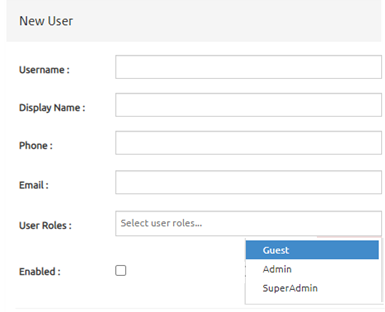

# User Management System

## Introduction
- User Management UI has 3 main component, at the beggining users will see [User List](#UserList) and [Header](#Header) Components, after new user action [User Form](#UserForm) will be appear, after user fills the filed of form, save button will be activated, after Save User action [User Form](#UserForm) will be submitted 

## Table of contents
- [Components](#components)
- [Actions](#actions)

## Components
  - ### Header
     
    - Header component has 3 item 
      - New User button
      - Hide Disabled User opinion
      - Save User button

  - ### UserList
     
    - User List with 4 columns are bellow
      - ID
      - User Name
      - Email
      - Enabled

  - ### UserForm
     
    - Includes: 
      - Username
      - Display Name 
      - Phone, Email 
      - User Roles(Guest,Admin,Super Admin)
      - Enabled

## Actions
- New User
  - This action will display New User Form component
- Save User
  - This action will save the User that created in the New User Form
- Filter 
  - Each filed in the User List component has own Filter action that filters the fields in the column
- Hide Disabled User
  - This action removes disabled users in the User List component 